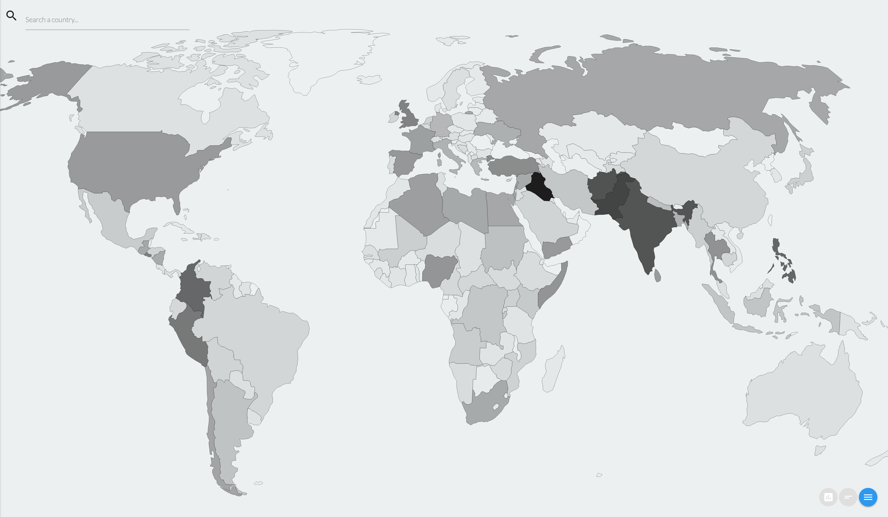
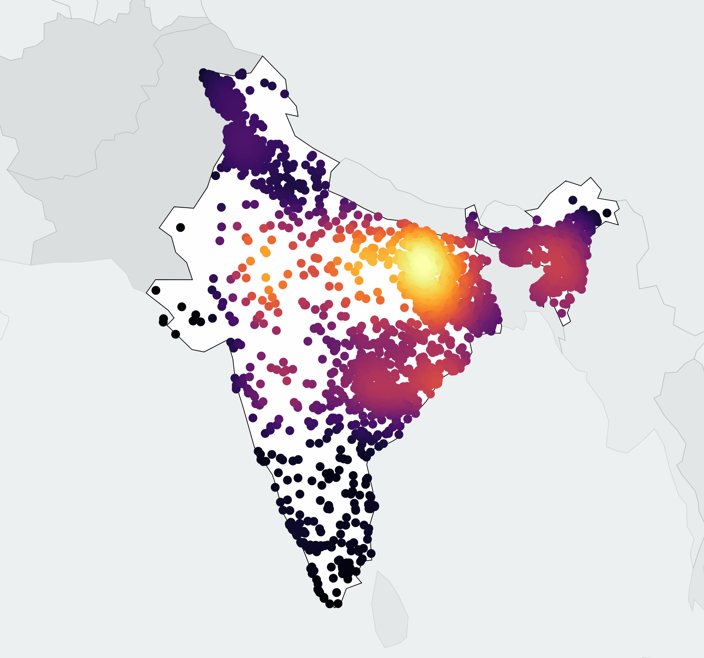
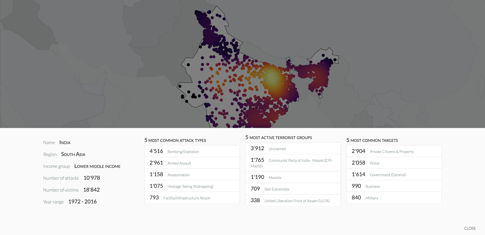
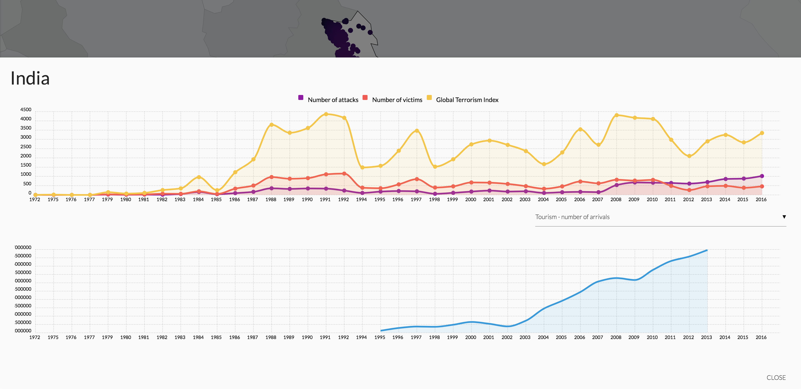

# Impact of Terrorism on World Development

# Milestone 3
[Notebook](https://github.com/Timonzimm/CS-401/blob/master/project/report/report.ipynb) Here states all the procedure we took in order to do the project.

[Website](http://54.93.102.178/) Here you can enjoy a much more interactive visualization of our project.

# Abstract
##### Definition of terrorism:
>"The threatened or actual use of illegal force and violence by a non-state actor to attain a political, economic, religious, or social goal through fear, coercion, or intimidation."

The idea of the project is to give insightful information about the potential correlation that exists between the development of a country and terrorist attacks occuring in that particular country. To do so, we will use the [dataset](https://www.kaggle.com/worldbank/world-development-indicators) provided by the World Bank along with an open-source [global terrorism database](https://www.kaggle.com/START-UMD/gtd).

The former will provide information about **world development indicators** such as CO2 emissions, birth death crude, number of hospital beds, all of this for more than 180 countries from 1960 to 2015. The latter dataset will provide information on location, tactics, perpetrators, targets, and outcomes for more than 170'000 **terrorist attacks** worldwide, from 1970 to 2016.

As the definition states, we expect to see a correlation on economic and social indicators, for countries which are targeted by these attacks.

## Research questions

- Study the correlation between terrorist attacks and social indicators.
- Study the correlation between terrorist attacks and economic indicators.

## Procedure

- Compute the Global Terrorism Index (GTI) and other aspects (number of attacks per year, top five most common attack types, ...).
- Compare it to a selected subset of the World Development Indicators (tourism, GDP, ...).

## Results

- Although the correlation might be taken with a very particular attention, one can learn a lot from the terrorist context in which a given country is growing.

# Website overview

The World map gives a good overview of the history of Terrorism.

When the user clicks on a country we can see where attacks did occur. The color scheme we choose fully reflects the intensity by which a region has been attacked, allowing to grasp a better picture of the situation. 

Interesting details and the top five most: common attack types, active terrorist groups and common targets are listed to give even more accuracy about the terrorist profile of the selected country.

Finally, two graphs are available. The first one gives information about the terrorist attacks (including the GTI). The second one plots a development indicator, for the available years, choosen from a subset of the world development indicators dataset. Both graphs allow to see if we can extract a correlation.

# Important note
It is important to notice that we will be merging this project with the one in the "Data Visualization" course.

# Contribution of group members
**Timon** Website design and development, preliminary data analysis.

**Jimi** Dataset cleaning and merging, devops for production server on AWS.

**Joël** Backend python and API, data exploration, final results.