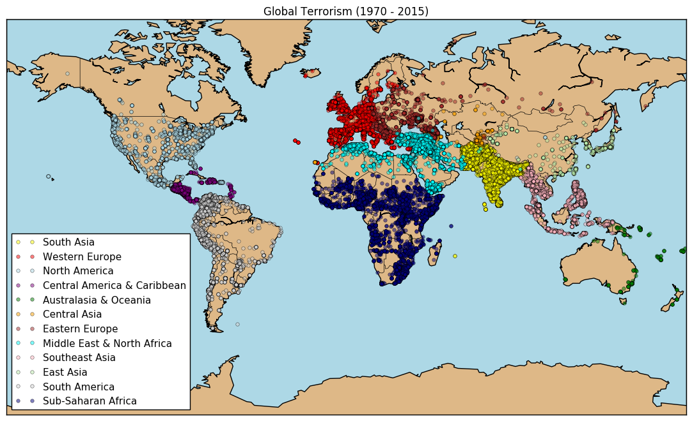
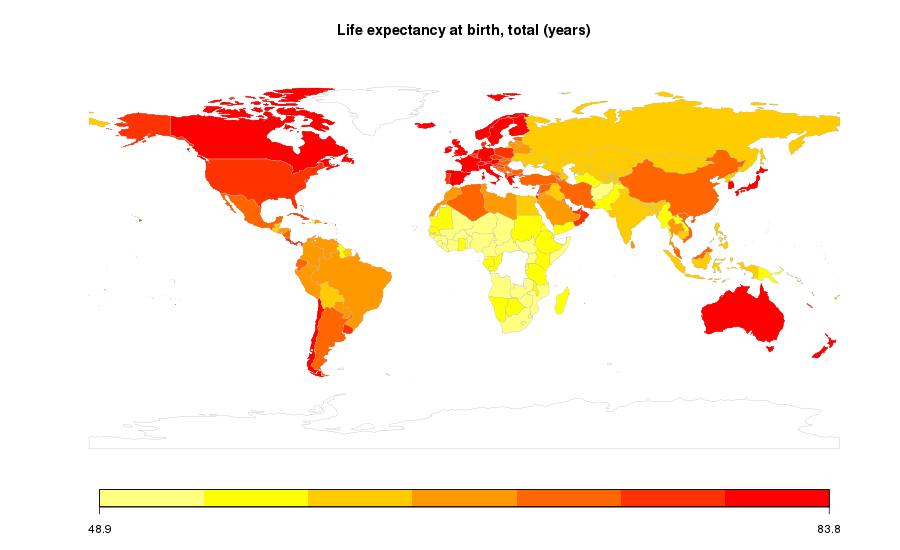

# Impact of Terrorism on World Development

# Notebook for milestone 2
[Notebook](https://github.com/Timonzimm/CS-401/blob/master/project/report/report.ipynb)

# Abstract
##### Definition of terrorism:
>"The threatened or actual use of illegal force and violence by a non-state actor to attain a political, economic, religious, or social goal through fear, coercion, or intimidation."

The idea of the project is to give insightful information about the potential correlation that exists between the development of a country and terrorist attacks occuring in that particular country. To do so, we will use the dataset provided by the World Bank along with an open-source global terrorism database.

The former will provide information about **world development indicators** such as CO2 emissions, birth death crude, number of hospital beds, all of this for more than 180 countries from 1960 to 2015. The latter dataset will provide information on location, tactics, perpetrators, targets, and outcomes for more than 170'000 **terrorist attacks** worldwide, from 1970 to 2016.

As the definition states, we expect to see a clear impact on economic and social indicators, for countries which are targeted by these attacks.

# Research questions
- Study the correlation between terrorist attacks and social indicators.
- Study the correlation between terrorist attacks and economic indicators.
- If there is an impact on one of these indicators, study the **recovery time** for these countries.
- If we want to automate the latter (recovery time), we will have to come up with some sort of criterion and see if it fits/works.

# Dataset
Global Terrorism Database: https://www.kaggle.com/START-UMD/gtd

World Development Indicators: https://www.kaggle.com/worldbank/world-development-indicators

First and foremost, not all the indicators are available for all countries and at any year, so just like the homeworks we will have to treat missing information. With this in mind, we will focus on particular timeframes surrounding an attack (e.g. 5 years prior and after), and on specific economic and social indicators available during this timeframe. We will merge the datasets starting by filtering a lot of indicators out, details in week 1 of milestone 1 hereafter.

To isolate the impact of the terrorist attack, and prune other factors of the equation (such as economic crisis and so on), we have to find a clever policy. From there we have thought about multiple possiblities:
1. Take a neighboring country (geographic wise) which did not get attacked, and compare it with the targeted country.
2. Pick multiple neighboring countries which were not attacked, and do a sort of averaging to compare them with the targeted country.
3. Try to find a country who has a high correlation with the targeted country for one or multiple indicators, during the 5 years prior to the attack. From there, compare the same indicator(s), the year of the attack and for 5 years afterwards.
4. Using a mathematical-based technique such as Pearson correlation coefficient.

This way, by picking a "sane" country, we hope to isolate the impact of the terrorist attack and be able to draw conclusions on the chosen indicators.

Datasets are in CSV format, the indicators dataset is much larger (1.9GB) since it contains plenty of information, while the dataset on terrorist attacks is much smaller (145MB) containing "only" 170'000 attacks. One very convenient point about the "World Indicators" dataset is the availability of a SQLite databse containing all the data.

Therefore, we will probably try to merge the "Terrorist Attacks" database into SQLite to have a very clean and ordered datasource to fetch from.

Here are a few examples of data that can be found in each dataset:

## Typical visitor flow
All of these will be done through a "Data Story" type of website:
1. Running on Django and displaying an interactive world-map with possible attacks to consider.
2. Once the user has picked an attack, display details as well as possible indicator(s) to consider.
3. The algorithm running on the Django server will propose one or several neighboring countries which had a highly-correlated trend prior to the attack (e.g. 5 years).
4. We would plot several data for the indicators to give insights about the trend shift that occured due to the attack.
5. Try to come up with an estimated recovery-time for the country based on the criterions chosen, and compare with indicators aftermath.

# Tasks for milestone 2
|Week&nbsp;#|Expected task|
|-----|-----|
|Week&nbsp;1|Data merging, cleaning, then select some typical indicators (social and economic) available for each timeframe (e.g. +- 5 years) of each attack. Try to come up with a clever strategy regarding policy chosen to compare countries.|
|Week&nbsp;2|Develop the webserver, template of the map(s) and interface design. Try to come up with a clever formula to approximate the recovery-time.|
|Week&nbsp;3|Link the front-end/back-end with the database to have a website up an running. Fix, tweak and adapt interfaces.|
|Week&nbsp;4|Analyze our results and visualizations. Use our website and seek out for potential alternative explanations in *historical events*, such as economic crisis, revolutions, and so on.|

# Tasks for milestone 3
|Week&nbsp;#|Expected task|
|-----|-----|
|Week&nbsp;1|Add the different development indicators to the website visualization having in mind the following questions: How to show them? What kind of plot is appropriate? Should we present them along with the attack indicators or not? Why? How to show the correlation with the attacks without under-/over-estimate the results?|
|Week&nbsp;2|Think about the story that will come in the website, write the abstract, and the guidelines about how to discover/learn from the content we provide.|
|Week&nbsp;3|Set up the website in terms of logistics (server, web host or script, etc.). Think about the poster: how to structure it and what should be said. |

# Important note
It is important to notice that we will be merging this project with the one in the "Data Visualization" course, hence we will detail exactly which parts belong to one or another class. More coming soon.

